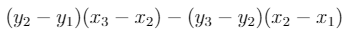

# Programozási nyelvek (BSc, 18) Java 2. gyakorlat

### 1. feladat

Készítsen egy `Point` osztályt `double` típusú `x` és `y` mezőkkel.
Írja meg a `move(dx,dy)` műveletet, mellyel egy pontot el lehet tolni `dx`
és `dy` koordinátákkal, valamint a `mirror(cx,cy)` műveletet, mely egy
`cx` és `cy` koordinátájú pontra való tükrözést valósít meg.

Készítsen `PointMain` néven Java programot, amelyben bemutatja a
`Point` osztály használatát.

### 2. feladat

Készítse el a `Point` osztályban a `mirror(p)` műveletet úgy, hogy paramétere
(a tükrözési középpont) egy `Point` objektum legyen!

Írjon `distance(p)` műveletet is, mely kiszámolja az adott pont távolságát
egy paraméterként kapott `p` ponttól. Használja a `Math.sqrt(...)`
függvényt és a Pitagorasz tételt!

Frissítse a `PointMain` osztályt az új műveletekkel!

### 3. feladat

Valósítsa meg a `Complex` osztályt `double` típusú valós és képzetes
résszel! Írjon `abs()` metódust, amely kiszámolja a komplex szám abszolút
értékét. Valósítsa meg az `add(c)`, a `sub(c)` és a `mul(c)` műveleteket
oly módon, hogy az `add` adja hozzá a komplex számhoz a paraméterként
kapott `c` komplex számot, a `sub` vonja ki belőle, a `mul` pedig
szorozza hozzá.

~~~{.java}
alpha.re = 3
alpha.im = 2
beta.re = 1
beta.im = 2
alpha.add(beta)
// alpha.re == 4 && alpha.im == 4 && beta.re == 1 && beta.im == 2
~~~

### 4. feladat

Készítsen `Circle` néven kört reprezentáló osztályt. Egy körnek van
középpontja (`x` és `y` nevű, `double` típusú adattag) és sugara (`radius`).

Írjon `enlarge(f)` metódust, amellyel a kör sugarát f-szeresére
változtatja, illetve `getArea()`  metódust, amely megadja a kör
területét. Használjuk a `Math.PI` értéket!

### 5. feladat

Készítse el a `Line` osztályt, mellyel egy adott sík egyeneseit
reprezentálhatjuk. Egy egyenest az  összefüggés ír
le, ahol `a`, `b` és `c` számok `double` típusúak. (Ezek lesznek
az osztály adattagjai.)

Írjon az osztályba egy `contains(p)` műveletet, mely eldönti,
hogy egy `p` pont rajta van-e az egyenesen!

Írjon egy `isParallelWith(l)` és egy `isOrthogonalTo(l)` metódust,
melyek eldöntik, hogy az egyenes párhuzamos-e a paraméterként kapott
`l` egyenessel, illetve merőleges-e rá!

### 6. feladat

Készítsen egy `Distance` programot. Ez a parancscsori paramétereket
pontoknak értelmezi: a pontok szóközzel elválasztva vannak felsorolva,
minden pontnál elöl az `x`, utána az `y` koordináta (ezek is szóközzel
elválasztva).

Feltételezhetjük, hogy páros számú paraméter van, amelyek mind egész számok.

A program a `Point` osztály felhasználásával számítsa ki és adja össze az
egymás mellett lévő pontok távolságát (pl. 3 pont esetén az 1. és a 2.
pont távolságához hozzá kell adni a 2. és a 3. pont távolságát), majd
az eredményt írja ki.

Példák:

~~~
> java Distance
0.0
> java Distance 1 2
0.0
> java Distance 0 0 3 4
5.0
> java Distance 1 2 4 6
5.0
> java Distance 1 2 4 6 7 6
8.0
~~~

### 1. gyakorló feladat

Készítsük el a Complex osztályba a `conjugate` műveletet, mely a
komplex számot átalakítja a komplex konjugáltjára. Készítsük el a
`reciprocate()` metódust, mely a komplex számot reciprokára alakítja.
Definiáljuk a `div(c)` művelet, mely elosztja a komplex számot a
paraméterként kapott `c` komplex számmal.

### 2. gyakorló feladat

Készítse el a `Segment` osztályt, mely egy szakaszt reprezentál.
A szakasz objektumok ábrázolásához a két végpont koordinátáit tároljuk
el. Az adattagok `x1`, `y1`, `x2`, `y2` legyenek, mind `double`
típusú.

Írjon az osztályba egy `line()` metódust, mely visszaad egy olyan
`Line` objektumot, amely a szakaszra illeszkedő egyenest reprezentál.

Írjon az osztályba egy `contains(p)` műveletet, mely eldönti,
hogy egy `p` pont rajta van-e a szakaszon!

Készítsen `orientation(p)` metódust a `Segment` osztályba, mely
eldönti, hogy a szakasz kezdőpontjából a végpontjába mutató vektor,
valamint a szakasz végpontjából a paraméterként kapott `p` pontba
mutató vektor milyen orientációjú. A metódus adjon vissza 0-t, ha
a `p` rajta van a szakasz által meghatározott egyenesen, adjon vissza
pozitív értéket, ha a két vektor az óramutató járásával megegyező irányban
van egymással, illetve negatív értéket, ha az óramutató járásával
ellenkező irányú. Ez elég egyszerű: ha a `p` pont koordinátáit `x3` és
`y3` jelöli, akkor a metódus az alábbi kifejezést adja vissza.

Készítsen egy `intersects(s)` metódust, mely visszaadja, hogy a
szakasznak van-e közös pontja a paraméterként kapott `s` szakasszal!
A megoldáshoz használja az alábbi segítséget!

<http://www.dcs.gla.ac.uk/~pat/52233/slides/Geometry1x1.pdf>

### 3. gyakorló feladat

Készítsük el a `Polygon` programot, mely a parancssori argumentumait
pontok koordinátájaként értelmezi (a `Distance` osztályhoz hasonlóan),
és eldönti, hogy a megadott pontok egy sokszöget határoznak-e meg.
Egy pontsorozatban az egymás mellett álló pontok a sokszög oldalait
adják meg. (Az utolsó oldalt a pontsorozat utolsó és első pontja
adja.)

Egy pontsorozat sokszöget határoz meg, ha az oldalak nem metszik
egymást. Használjuk a `Segment` osztályt!

~~~
> java Polygon 0.0 0.0 3.0 3.0 3.0 1.0 2.0 3.0
false
~~~

### 4. gyakorló feladat

Alakítsuk át a programot úgy, hogy minden egyes parancssori argumentumot
egy pont koordinátájának értelmezzen. Feltesszük, hogy minden parancssori
argumentum `x;y` alakú, ajol `x` és `y` két szám.

~~~
> java Polygon 0.0;0.0 3.0;3.0 3.0;1.0 2.0;3.0
false
~~~

### 5. gyakorló feladat

Készítsük el a `Convex` programot, mely a parancssori argumentumait
pontok koordinátájaként értelmezi, és eldönti, hogy a megadott pontok
konvex sokszöget határoznak-e meg.

### 6. gyakorló feladat

Készítsen egy `Pizza` osztályt, amellyel egy pizzát reprezentálunk.
A `Pizza` osztályban legyenek adattagok, amelyeket a felhasználó
beállíthat: normal/large, milyen feltétek (sonka, gomba, kukorica,
sajt, szalámi, tojás) és milyen alap. Az osztály adjon lehetőséget
a pizza árának kiszámítására. A `large` 2.5-szeres árú, 3-nál több
feltétnél feltétenként plusz 100 Ft.

Készítsen főprogramot, amelyben a felhasználó megrendelést adhat le
(több pizzát is rendelhet) és a végén kiírja a rendelés összegét.

